<h1 align="center">MERN Stack - iTravel</h1>

 

 

---
<h2><strong>About</h2></strong>

iTravel is a platform enabling users to get unique state-specific travel products by being exposed to local businesses of the respective states.

When planning for a vaction to any state of India, iTravel offers you different accessories and products that are must-haves while travelling to those respective states.

---

<h2><strong>Instructions to run the website</h2></strong>

* Install dependencies for server `npm install`

* Install dependencies for client: cd client ---> `npm install`

* Connect to your mongodb and add info in .env
 
* Run the client & server with concurrently `npm run dev`

* Run the Express server only `npm run server`
 
* Run the React client only `npm run client`
 
* Server runs on http://localhost:5000 and client on http://localhost:3000

---

<h2><strong>Features</h2></strong>

* SignUp/Login for customers as well as the Admin

* Select Through All Available Accessories and Products From Different Categories 

* Filter from Oldest to Newest or Newest to Oldest products added to the website

* Filter for various different categories

* Easy Navigation 

* Detailed Product Overview including small businesses the user can buy the product from and the least available price for the product

* Display of related products to the product being overviewed

* Seamless Search & Add to Saved Products List Option

* Update/Delete Items in your account's Saved Products List

* Create products and Categories (Option available only for the Admin)

* Delete certain products from the website (Option available only for the Admin)

* Admin can delete categories only after deleting the products from thst respective category

---

<h2><strong>Website Screenshots</strong></h2>

<h3>Sign-In/ Sign-Up</h3>
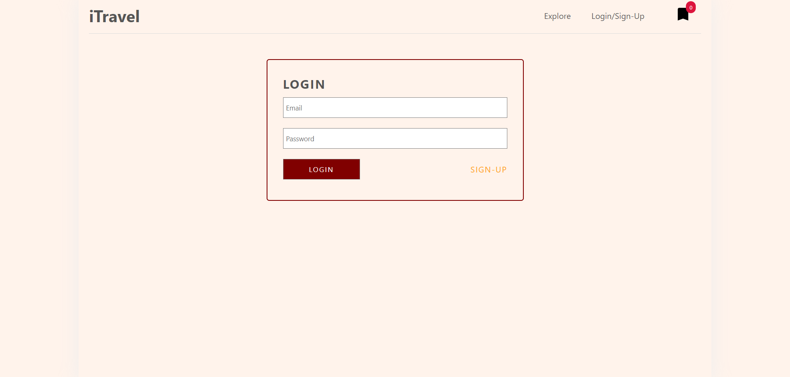
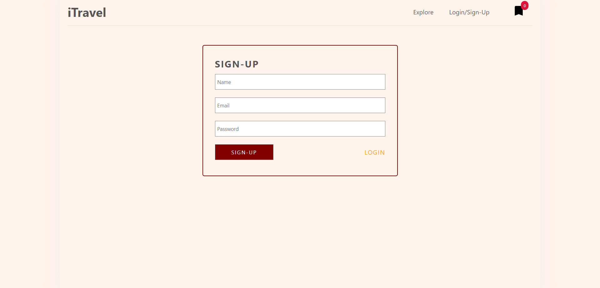
<h3>Explore Page</h3>
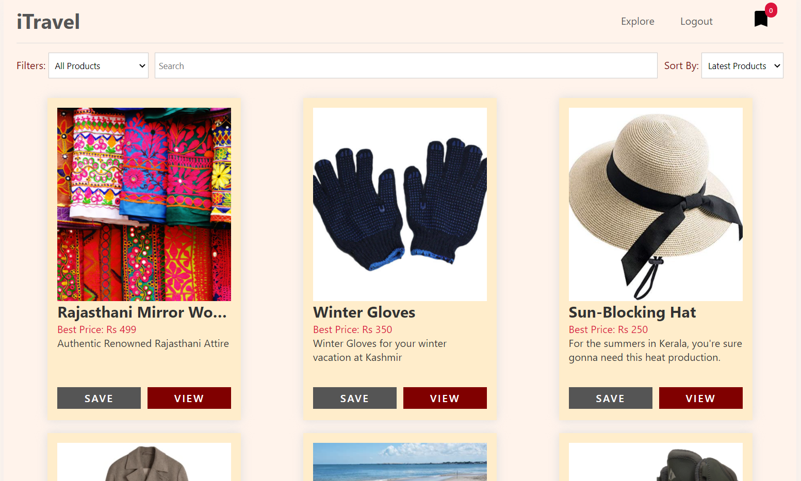
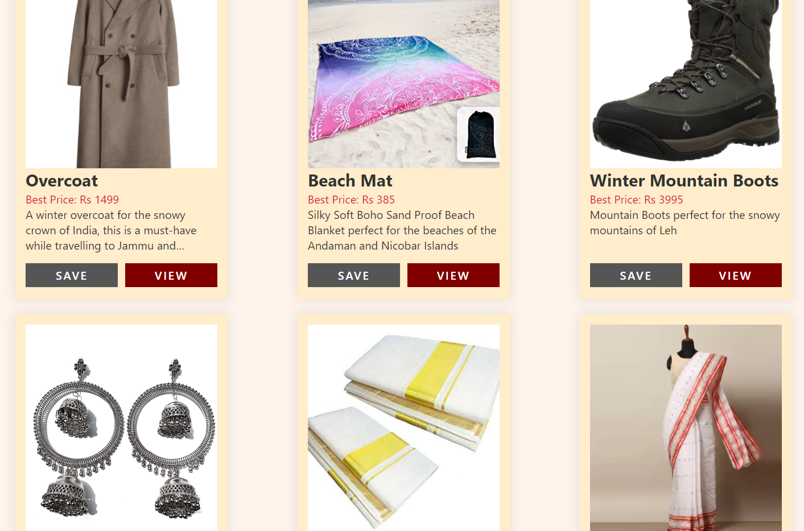
<h3>Product Overview</h3>
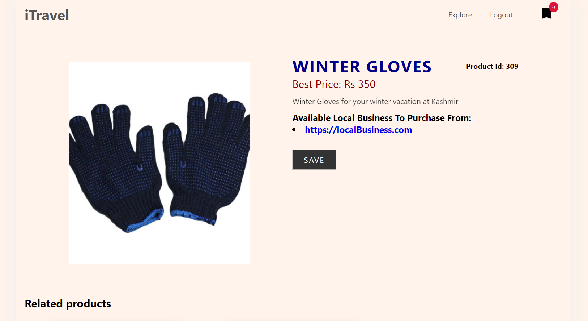
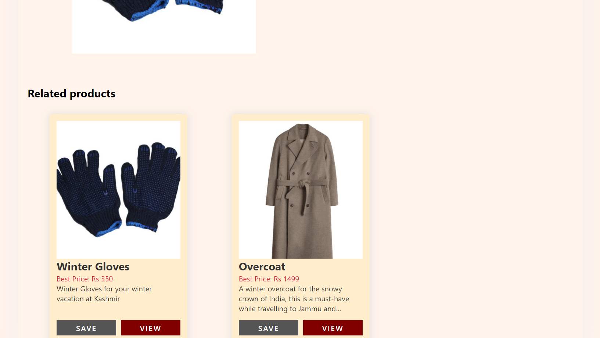
<h3>Saved Products List</h3>
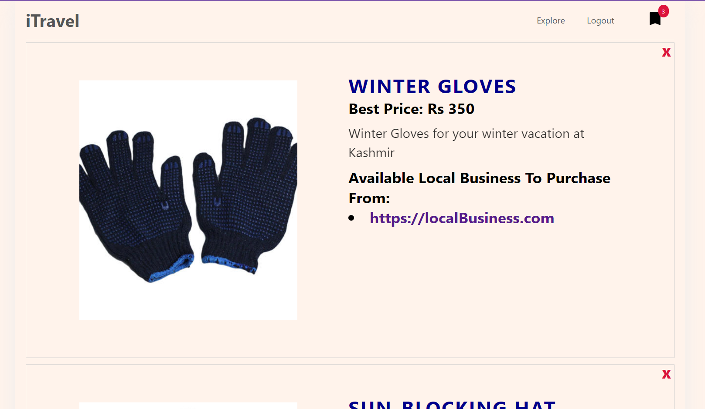
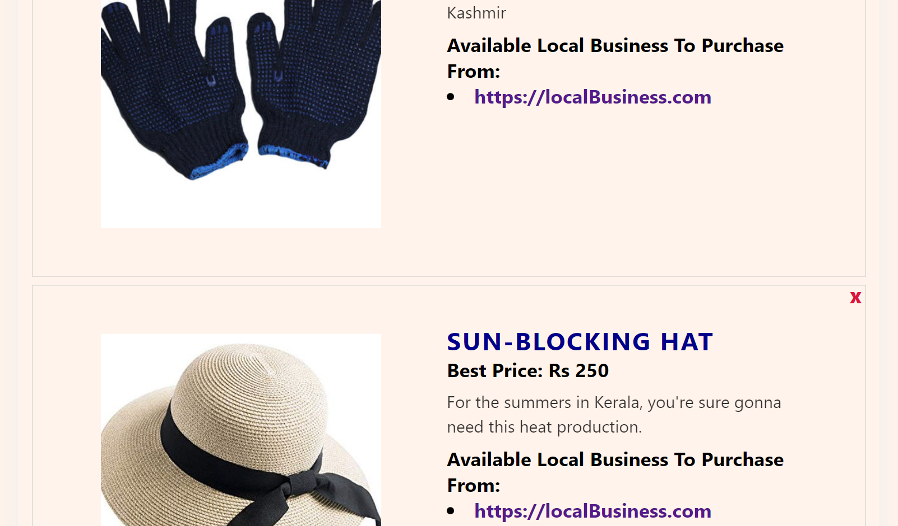
<h3>Products List for Admin</h3>
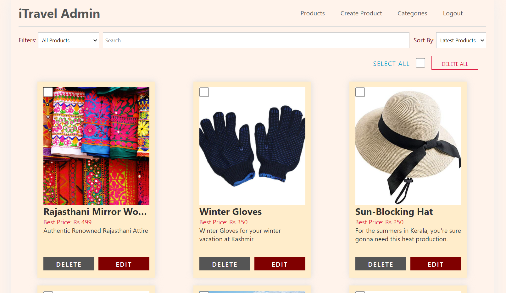
<h3>Create Product for Admin</h3>
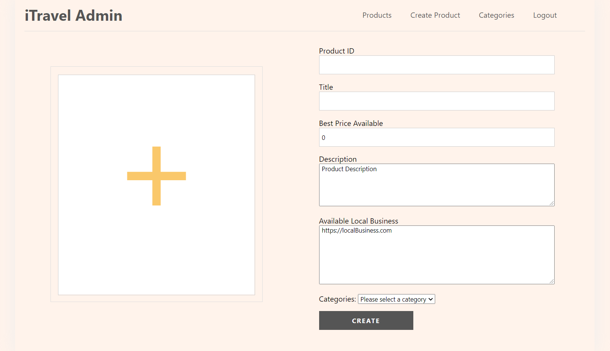
<h3>Create category for Admin</h3>
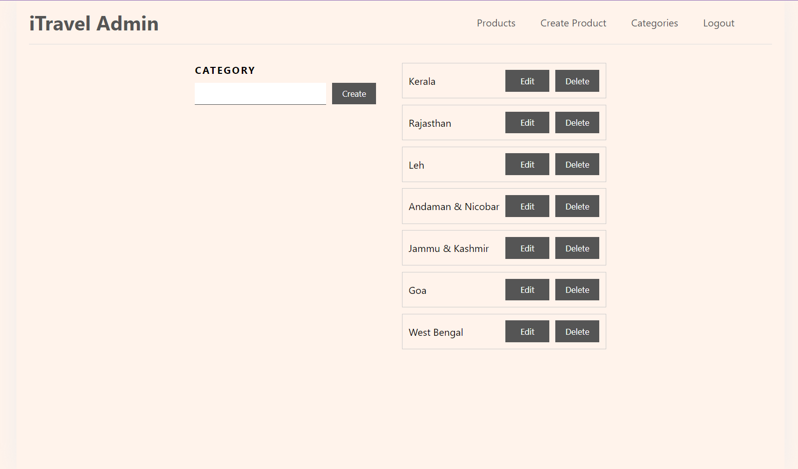
<h3>Update Product for Admin</h3>
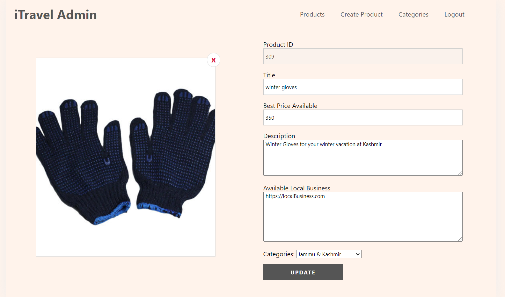
<h3>Category Filter</h3>
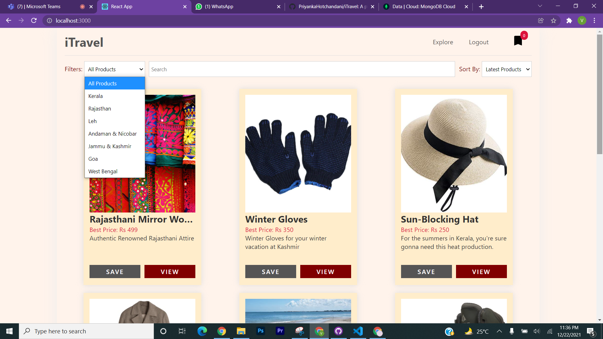
<h3>Latest/Oldest Filter</h3>
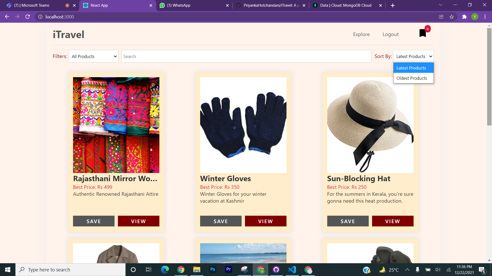
<h3>Search Feature</h3>
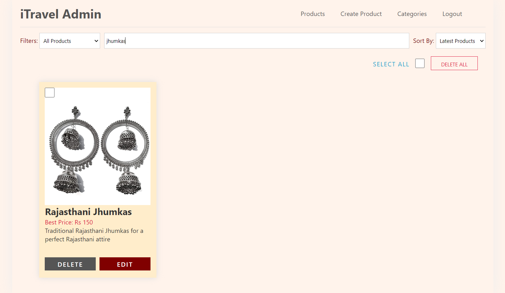
  

---

 
<h2 align="center"><b>DEVELOPED BY</b></h2> 

